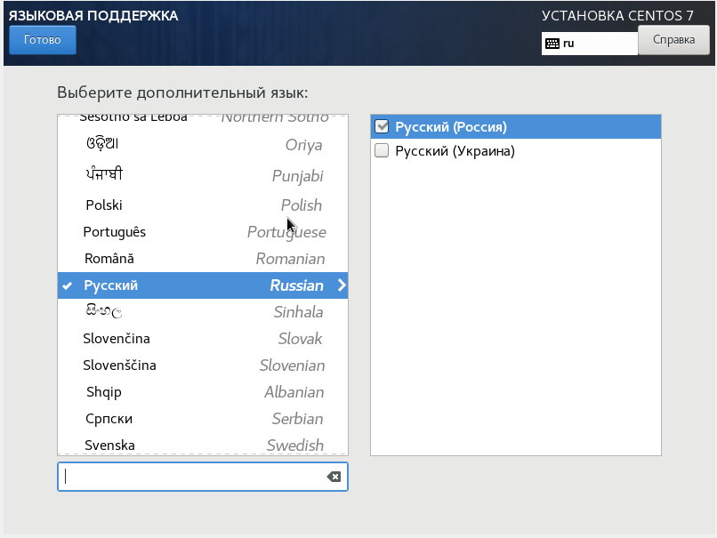
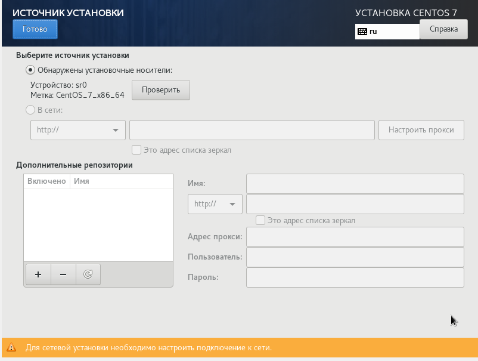

---
## Front matter
lang: ru-RU
title: "Лабораторная работа №1. Установка вертуальной машины."
author:
    - Евдокимов Иван Андреевич. НФИбд-01-20

institute:
    - Российский Университет Дружбы Народов

date: 9 сентября, 2023, Москва, Россия

## Formatting
mainfont: PT Serif
romanfont: PT Serif
sansfont: PT Sans
monofont: PT Mono
toc: false
slide_level: 2
theme: metropolis
header-includes: 
 - \metroset{progressbar=frametitle,sectionpage=progressbar,numbering=fraction}
 - '\makeatletter'
 - '\beamer@ignorenonframefalse'
 - '\makeatother'
aspectratio: 43
section-titles: true
---

# Цели и задачи работы

## Цель лабораторной работы

Целью данной работы является приобретение практических навыков
установки операционной системы на виртуальную машину, настройки минимально необходимых  для дальнейшей работы сервисов.

---

## Задание к лабораторной работе

1. Создать и настроить виртуальную машину через VirtualBox.
2. Скачать и устоновить образ CentOS.
3. Запуск образа диска дополнений гостевой ОС и настроить систему.

---

# Процесс выполнения лабораторной работы
## Пункт 1: создание виртуальной машины

---

## Пункт 1.1
Запустив VirtualBox создаю новую виртуальную машину которую назову "centos", создав предварительно для него папку в директории пользователя и оставив версию Red Hat так как она рекомендована инструкцией.

{#fig:001 width=70% height=70%}

---

## Пункт 1.2
На следующем пункте увиличивую значение параметров системы для более коректной  и приятной работы в дальнейшем.

{#fig:002 width=70% height=70%}

---

## Пункт 1.3
Здесь я предоставил виртуальной машине 21 ГБ вместо 20, с запасом и указал "выделения в полном размере".

{#fig:003 width=70% height=70%}

---

## Пункт 1.4
Проверив введённые создаю виртуальную машину.

{#fig:004 width=70% height=70%}

---

# Пункт 2: Скачивание и настройка носителя

Предварительно скачав подходящую версию образа CentOS 7 использую её как носителя, и запускаю виртуальную машину.
{#fig:005 width=70% height=70%}

---

# Пункт 3: Устоновка CentOS

---

## Пункт 3.1
Дальше мы видем образ устоновки где идут основные параметры устоновки и зайдём в каждый из них.

В первом разделе "Дата и время" проверяю праильно ли был устоновлем часовой пояс, время и дата.

{#fig:008 width=70% height=70%}

---

## Пункт 3.2
Второй раздел позваляет настроить порядок инициализации языков которые используется на клавиатуре.

{#fig:009 width=70% height=70%}

---

## Пункт 3.3
В третьем разделе можно выбрать дополнительный язык (к основному английскому), выбираю русский.

{#fig:010 width=70% height=70%}

---

## Пункт 3.4
Дальше смотрю раздел "источника установки", оставляем ранее утановленный образ диска.

{#fig:011 width=70% height=70%}

---

## Пункт 3.5
В разделе "выбор программ" выбираю "сервер GUI" так как он нам подходит и также в дополнительных указываю "Средства разработки".

{#fig:012 width=70% height=70%}

---

## Пункт 3.6
Дальше выбираю место устоновки как созданное виртуальное пространство.

{#fig:013 width=70% height=70%}

---

## Пункт 3.7
В следуешем разделе отключаю KDUMP так как он не понадовится.

{#fig:014 width=70% height=70%}

---

## Пункт 3.8
И в последнем разделе нужном мне включаю ethernet и называю узел (хост).

{#fig:015 width=70% height=70%}

---

## Пункт 4: Настройка пользователя и root

---

## Пункт 4.1
На данном этапе начинается сама установка компонентов в это время мы можем настроить root-права и создать первого пользователя.

{#fig:016 width=70% height=70%}

---

## Пункт 4.2
Здесь указываю удобный пороль для получения root-прав.

{#fig:017 width=70% height=70%}

---

## Пункт 4.3
В этом разделе указываю основные параметры для пользователя: имя, права администратора и пороль.

{#fig:018 width=70% height=70%}

---

## Пункт 4.4
После не большого ожидания завершаем устоновку перезапустив виртуальную машину.

{#fig:019 width=70% height=70%}

---

## Пункт 5: Устоновка образа диска доп. гост. ОС

---

## Пункт 5.1
После перезапуска у нас открывается последнее окно, приняв лицензию, мы завершаем устоновку и входим в систему.

{#fig:020 width=70% height=70%}

---

## Пункт 5.2
Здесь мы принимаем лицензию от CentOS.

{#fig:021 width=70% height=70%}

---

## Пункт 5.3
После закрытия ознакомительной части при первом запуске выхожу из окна системы и перехожу в раздел устройства выше и подключаю образ диска дополнительного гостевого ОС.

{#fig:021 width=70% height=70%}

---

{#fig:022 width=70% height=70%}

---

## Пункт 5.4
И устанавливаем его. дождавшись завершения установки перезапускаем виртуальную машину и среда готова к использованию.

{#fig:023 width=70% height=70%}

---

{#fig:023 width=70% height=70%}

---

{#fig:023 width=70% height=70%}

---

# Контрольные вопросы

---

## 1. Какую информацию содержит учётная запись пользователя?

Все важные данные о пользователя в систему, хранятся в файлах "/etc/passwd", так в учётной записи хранится в первую очередь ID пользователя (где 0 это с root-правами и в системе CentOS 1-999 обычные пользователи), логин, пороль, идентификаторе группы, идентификаторе пользователя, начальный каталог и регистрационная оболочка. Если детально расмотреть структуру хранящихся данных то у нас получится такая строка данных: "User ID":"Password":"UID":"GID":"User Info":"Home Dir":"Shell".

---

## 2. Укажите команды терминала и приведите примеры:

– для получения справки по команде;
Для этого можно использовать команду "man", данная команда может предоставить инструкцию или справку по использованию команды или программы. Если нужна краткая информация можно применить команду "whatis".

– для перемещения по файловой системе;
Чтобы перемещаться нужно знать где ты и куда можешь пойти для этого есть команда "ls" позволяющая просмотреть содержание нынешней папки, а также комадна "ll" позволяющая просмотреть начинку директории. И самая главная команда "cd" - меняет текущий каталог на указанный, при пустом вводе перемещает на уровень выше в древе каталога.

– для просмотра содержимого каталога;
Как я указал выше для этого есть команда "ls" позволяющая просмотреть содержание нынешней папки, а также комадна "ll" позволяющая просмотреть начинку директории.

– для определения объёма каталога;
В большенстве систем на linux можно использовать команду "sudo du" (особенно утилита du) она выведит занимаемое котологом место на диске.

– для создания / удаления каталогов / файлов;
Стандартная команда для создание каталога или директории (файлов) "mkdir", а также команды для взаимодействия с ними: "cp" - основная задача копирование и дублирование, "mv" - перемещение и переиминовывание, "rm" - удаление папок и файлов. Также есть команда "cat" - показывает что содержит файл или стандартный ввод, а также "ln" - создающая фактически ссылку как в windows ярлыки.

– для задания определённых прав на файл / каталог;
фЕдинственная универсальная команда помимо задания прав при создании файла это "chmod".

– для просмотра истории команд.
Для этого есть стандартная команда "history", так помимо опций указав число после команды она выведет именно столько последних команд.

---

## 3. Что такое файловая система? Приведите примеры с краткой характеристикой.

Одно из определений гласит "Файловая система связывает носитель информации (хранилище) с прикладным программным обеспечением, организуя доступ к конкретным файлам при помощи функционала взаимодействия программ API". Тоесть файловая система это набор драйверов встроенных в систему которая при обращение программы к файлу по его имени (адресу) предостовляет информацию, касающуюся типа носителя, на котором записан файл, и структуры хранения данных. Получается на деле драйверы ФС оптимизируют запись и считывание отдельных частей файлов для ускоренной обработки запросов.

Так на система типа Linux можно увидеть много разных ФС: Ext2, Ext3, Ext4, JFS, ReiserFS, XFS, Btrfs, ZFS и т.д. А например на Windows в основном используется NTFS для внутрених файлов и FAT32 (или NTFS) для флешек и внешних насителей есть и другие, но они не так важны и универсальны. И на Android особенно более современных стоит Ext4 - внутренняя и FAT32 - внешняя.

NTFS (файловая система новой технологии) - стандарт был реализован в Windows NT в 1995 году, и по сей день является основным в Windows. Система NTFS имеет допустимый предел размера файлов до 16 гигабайт и размер диска (памяти) до 16 Эксабайт, а также Использование метод «прозрачного шифрования» (Encryption File System) разделяя доступ к файлом для разных пользователей и приложений.

---

## 4. Как посмотреть, какие файловые системы подмонтированы в ОС?

На большинстве современных систем можно легко и быстро определить это в свойствах диска. Но на разных системах Linux есть свои способы это проверить через настройки системы или команды. Так например эту информацию можно получить через утилиту Gnome Диски.

---

## 5. Как удалить зависший процесс?

В windows быстрее всего это сделать через диспечер задач или консоль (Win+R; cmd; tasklist; Taskkill "процесс"). В сестемах Linux есть несколько команд для этого с разной степень серьёзности: "SIGINT" - оправляет приложение команду правильного безопасного завершения, "SIGQUIT" - отличается от предыдущей возможностью проигнорировать сигнал и созданием dump-памяти, "SIGHUP" - сообщает процессу о разрыве соединения с терминалом (в основном связана с неполадками интернета), "SIGTERM" - немедленное завершение процесса проводимого самим процессом или дочерними, "SIGKILL" - зевершение процесса через ядро не мгновенное; и команды для убийства: "kill" - и тут многое зависит от опции если её нет то используется одна из выше указанных, если стоит "-TERM" то пытается принудительно или настойчиво закрыть процесс, и если это не помагает то испольуем "-KILL" что направляет все силы на уничтожение процесса.
