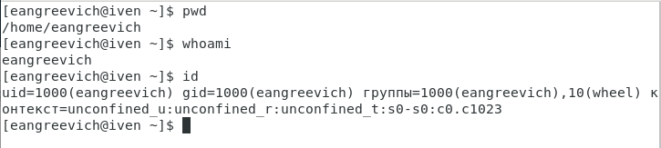
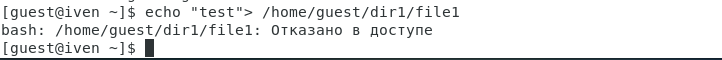

---
## Front matter
lang: ru-RU
title: "Лабораторная работа №2. Дискреционное разграничение прав в Linux. Основные атрибуты."
author:
    - Евдокимов Иван Андреевич. НФИбд-01-20

institute:
    - Российский Университет Дружбы Народов

date: 11 сентября, 2023, Москва, Россия

## Formatting
mainfont: PT Serif
romanfont: PT Serif
sansfont: PT Sans
monofont: PT Mono
toc: false
slide_level: 2
theme: metropolis
header-includes: 
 - \metroset{progressbar=frametitle,sectionpage=progressbar,numbering=fraction}
 - '\makeatletter'
 - '\beamer@ignorenonframefalse'
 - '\makeatother'
aspectratio: 43
section-titles: true
---
# Цель лабораторной работы

Получение практических навыков работы в консоли с атрибутами файлов, закрепление теоретических основ дискреционного разграничения доступа в современных системах с открытым кодом на базе ОС Linux.

# Процесс выполнения лабораторной работы

1. В установленной ОС создаю учетную запись пользователя guest.

{#fig:001 width=70% height=70%}

---

2. Задаю пароль для созданного пользователя.

{#fig:002 width=70% height=70%}

---

3. Вхожу в систему от имени созданного пользователя.

{#fig:003 width=70% height=70%}

---

4. С помощью команды pwd определяю директорию. Определяю, что она является домашней.

{#fig:004 width=70% height=70%}

---

5. Уточняю имя пользователя командой whoami.

{#fig:005 width=70% height=70%}

---

6. Уточняю имя пользователя, группу, и группы, куда входит пользователь.

{#fig:008 width=70% height=70%}

---

7. Сравниваю полученные данные с данными в приглашении командной строке.

{#fig:009 width=70% height=70%}

---

8. Просматриваю файл /etc/passwd командой cat /etc/passwd. Нахожу в нем свою учетную запись

{#fig:010 width=70% height=50%}

{#fig:010 width=70% height=20%}

---

9. Определите существующие в системе директории командой ls -l /home/ Удалось ли мне получить список поддиректорий директории /home? Какие права установлены на директориях?

{#fig:011 width=70% height=70%}

---

10. Проверяю, какие расширенные атрибуты установлены на поддиректориях, находящихся в директории /home, командой: lsattr /home Удалось ли мне увидеть расширенные атрибуты директории? Удалось ли мне увидеть расширенные атрибуты директорий других пользователей?

{#fig:012 width=70% height=70%}

---

11. Создаю в домашней директории поддиректорию dir1 командой mkdir dir1 Определяю командами ls -l и lsattr, какие права доступа и расширенные атрибуты были выставлены на директорию dir1.

{#fig:013 width=70% height=70%}

---

12. Снимаю с директории dir1 все атрибуты командой chmod 000 dir1 и проверяю с её помощью правильность выполнения команды ls -l

{#fig:014 width=70% height=70%}

---

13. Совершаю попытку создания в директории dir1 файл file1 командой echo "test" > /home/guest/dir1/file1. Проверяю командой ls -l /home/guest/dir1 действительно ли файл file1 не находится внутри директории dir1.

{#fig:015 width=70% height=70%}

---

14. Заполняю таблицу «Установленные права и разрешённые действия» (см. табл. 2.1), выполняя действия от имени владельца директории (файлов), определив опытным путём, какие операции разрешены, а какие нет. Если операция разрешена, занесите в таблицу знак «+», если не разрешена, знак «-». Замечание 1: при заполнении табл. 2.1 рассматриваются не все атрибуты файлов и директорий, а лишь «первые три»: г, w, х, для «владельца». Остальные атрибуты также важны

{#fig:016 width=70% height=70%}

---

15. На основании заполненной таблицы определяю те или иные минимально необходимые права для выполнения операций внутри директории dir1, заполню табл. 2.2.

{#fig:017 width=70% height=70%}

# Выводы:

Получены пракические навыки работы в консоли с атрибутами файлов, закреплены теоретические основы дискреционного разграничения доступа в современных системах на базе ОС Linux.