---
## Front matter
lang: ru-RU
title: "Лабораторная работа №3. Дискреционное разграничение прав в Linux. Два пользователя."
author:
    - Евдокимов Иван Андреевич. НФИбд-01-20

institute:
    - Российский Университет Дружбы Народов

date: 11 сентября, 2023, Москва, Россия

## Formatting
mainfont: PT Serif
romanfont: PT Serif
sansfont: PT Sans
monofont: PT Mono
toc: false
slide_level: 2
theme: metropolis
header-includes: 
 - \metroset{progressbar=frametitle,sectionpage=progressbar,numbering=fraction}
 - '\makeatletter'
 - '\beamer@ignorenonframefalse'
 - '\makeatother'
aspectratio: 43
section-titles: true
---
# Цель лабораторной работы

Получение практических навыков работы в консоли с атрибутами фай
лов для групп пользователей.

# Процесс выполнения лабораторной работы

---

1. В установленной ОС создаю учетную запись пользователя guest. Задаю пароль для созданного пользователя.

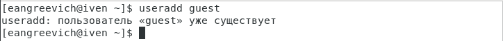{#fig:001 width=70% height=70%}

{#fig:002 width=70% height=70%}

---

2. Создаю пользователя guest2.

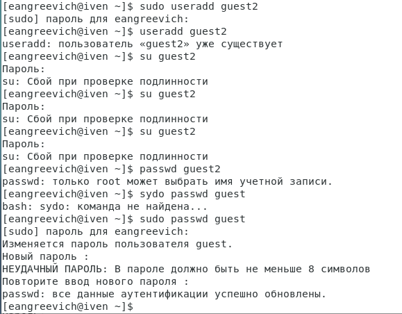{#fig:003 width=70% height=70%}

---

3. Добавляю пользователя guest2 в группу guest. Вхожу в систему от двух пользователей, в двух разных консолях.

---

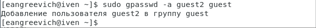{#fig:004 width=70% height=70%}

---

4. Добавьте пользователя guest2 в группу guest:
gpasswd -a guest2 guest

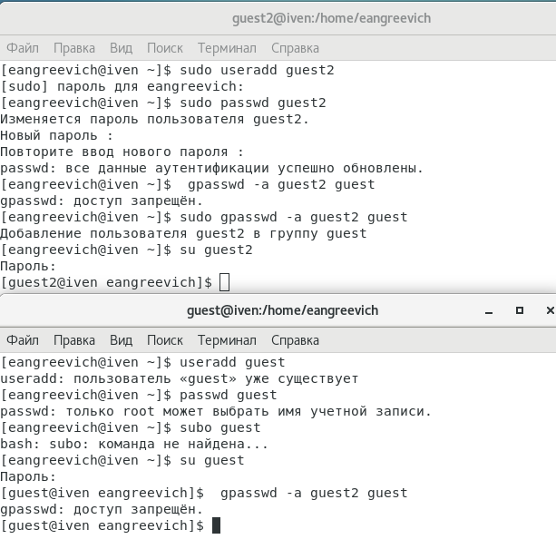{#fig:005 width=70% height=70%}

---

5. С помощью команды pwd определяю директорию. Определяю, что она является домашней.

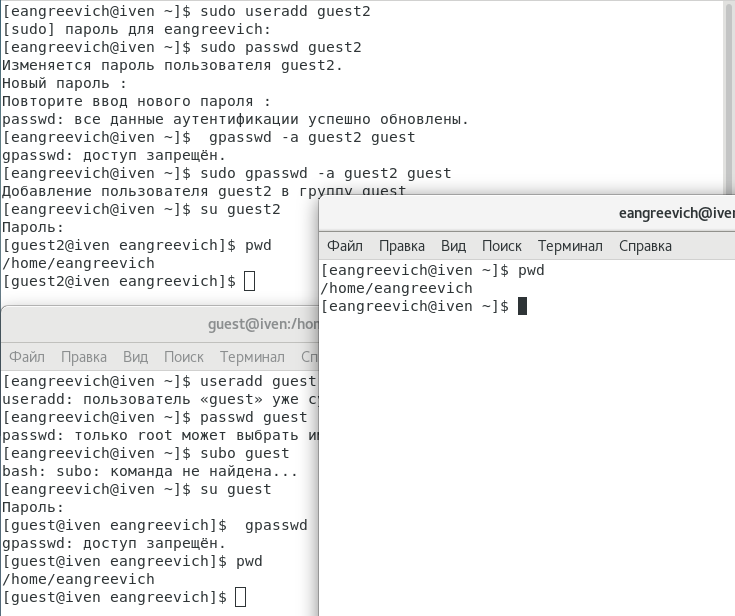{#fig:006 width=70% height=70%}

---

6. Уточняю имя пользователя, его группу, кто входит в неё и к каким группам принадлежит он сам. Определяю командами groups guest и groups guest2, в какие группы входят пользователи guest и guest2. Сравниваю вывод команды groups с выводом команд id -Gn и id -G..

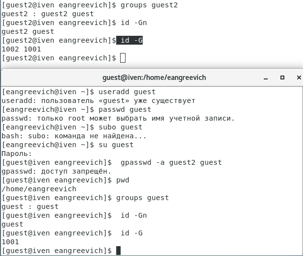{#fig:007 width=70% height=70%}

---

7. Сравниваю полученные данные с содержимым файла /etc/group.

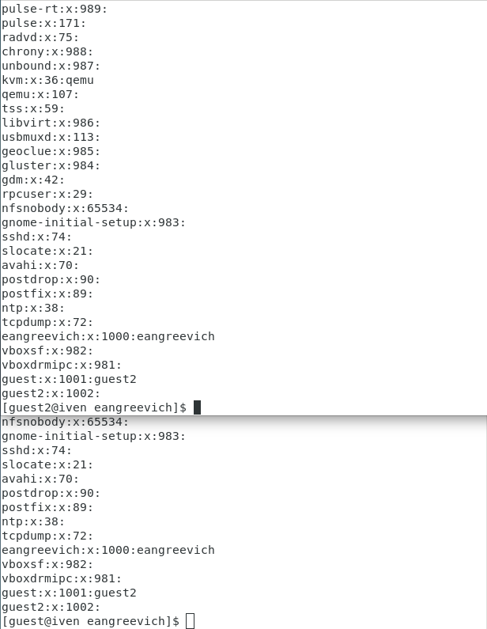{#fig:008 width=70% height=70%}

---

8. Сравниваю полученные данные с данными в приглашении командной строке.

{#fig:009 width=70% height=70%}

---

9. От имени пользователя guest измените права директории /home/guest, разрешив все действия для пользователей группы:

chmod g+rwx /home/guest

{#fig:010 width=70% height=20%}

---

10. От имени пользователя guest снимите с директории /home/guest/dir1
все атрибуты командой chmod 000 dir1 и проверьте правильность снятия атрибутов

{#fig:011 width=70% height=70%}

---

11. Меняя атрибуты у директории dir1 и файла file1 от имени пользователя guest и делая проверку от пользователя guest2, заполните табл. 3.1,
определив опытным путём, какие операции разрешены, а какие нет. Если операция разрешена, занесите в таблицу знак «+», если не разрешена,
знак «-».

---

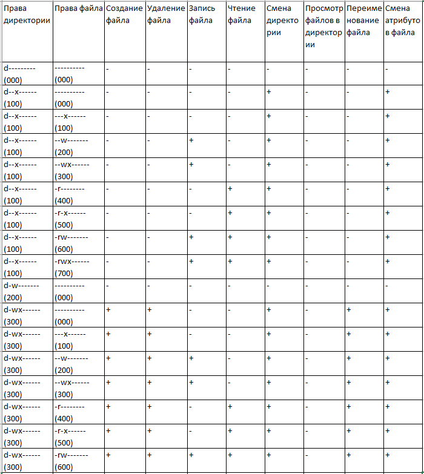{#fig:012 width=70% height=70%}

---

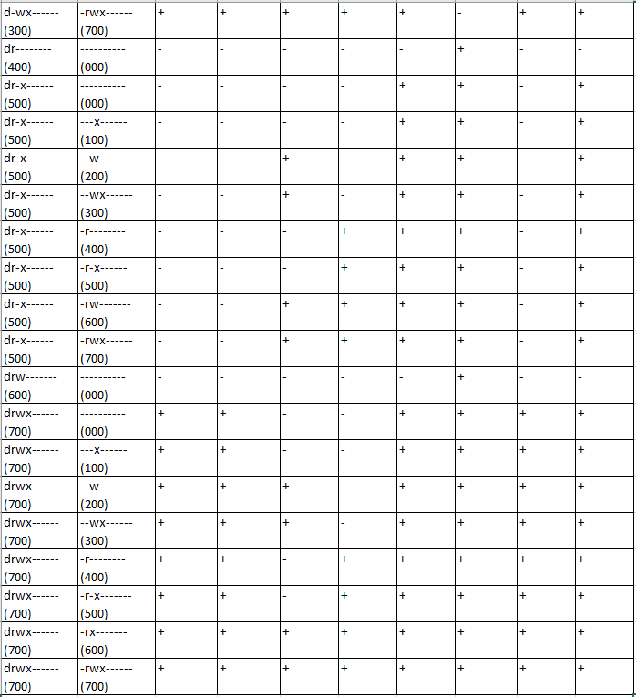{#fig:013 width=70% height=70%}

---

12. Сравниваю табл. 2.1 (из лабораторной работы № 2) и табл. 3.1.
На основании заполненной таблицы определите те или иные минимально необходимые права для выполнения пользователем guest2 операций
внутри директории dir1 и заполните табл. 3.2.

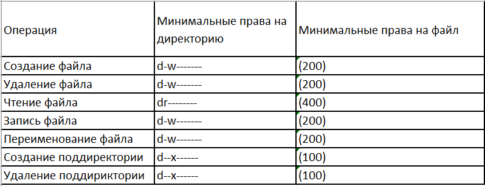{#fig:014 width=40% height=40%}

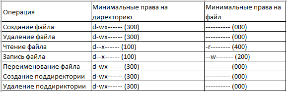{#fig:015 width=40% height=40%}

---

# Выводы:

Получены пракические навыки работы в консоли с атрибутами файлов, закреплены теоретические основы дискреционного разграничения доступа в современных системах на базе ОС Linux с двумя пользователями.