---
## Front matter
title: "Отчёт по лабораторной работе №3"
subtitle: "Дисциплина: Информационная безопасность"
author: "Евдокимов Иван Андреевич"

## Generic otions
lang: ru-RU
toc-title: "Содержание"

## Bibliography
bibliography: bib/cite.bib
csl: pandoc/csl/gost-r-7-0-5-2008-numeric.csl

## Pdf output format
toc: true # Table of contents
toc-depth: 2
lof: true # List of figures
lot: true # List of tables
fontsize: 12pt
linestretch: 1.5
papersize: a4
documentclass: scrreprt
## I18n polyglossia
polyglossia-lang:
  name: russian
  options:
	- spelling=modern
	- babelshorthands=true
polyglossia-otherlangs:
  name: english
## I18n babel
babel-lang: russian
babel-otherlangs: english
## Fonts
mainfont: PT Serif
romanfont: PT Serif
sansfont: PT Sans
monofont: PT Mono
mainfontoptions: Ligatures=TeX
romanfontoptions: Ligatures=TeX
sansfontoptions: Ligatures=TeX,Scale=MatchLowercase
monofontoptions: Scale=MatchLowercase,Scale=0.9
## Biblatex
biblatex: true
biblio-style: "gost-numeric"
biblatexoptions:
  - parentracker=true
  - backend=biber
  - hyperref=auto
  - language=auto
  - autolang=other*
  - citestyle=gost-numeric
## Pandoc-crossref LaTeX customization
figureTitle: "Рис."
tableTitle: "Таблица"
listingTitle: "Листинг"
lofTitle: "Список иллюстраций"
lotTitle: "Список таблиц"
lolTitle: "Листинги"
## Misc options
indent: true
header-includes:
  - \usepackage{indentfirst}
  - \usepackage{float} # keep figures where there are in the text
  - \floatplacement{figure}{H} # keep figures where there are in the text
---

# Техническое оснащение:

+ Персональный компьютер с операционной системой Windows 10;
+ OBS Studio, использующийся для записи скринкаста лабораторной работы;
+ Приложение Visual Studio Code для редактирования файлов формата *md* , а также для конвертации файлов отчётов и презентаций;

# Цель работы: 

Получение практических навыков работы в консоли с атрибутами фай- лов для групп пользователей.

# Выполнение лабораторной работы

1. В установленной ОС создаю учетную запись пользователя guest. Задаю пароль для созданного пользователя.

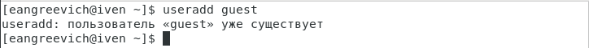{#fig:001 width=70% height=70%}

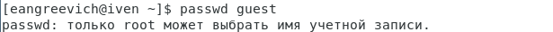{#fig:002 width=70% height=70%}

2. Создаю пользователя guest2.

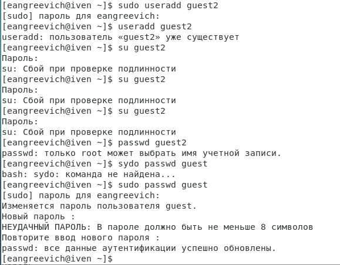{#fig:003 width=70% height=70%}

3. Добавляю пользователя guest2 в группу guest. Вхожу в систему от двух пользователей, в двух разных консолях.

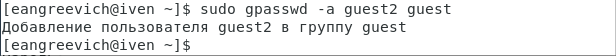{#fig:004 width=70% height=70%}

4. Добавьте пользователя guest2 в группу guest:
gpasswd -a guest2 guest

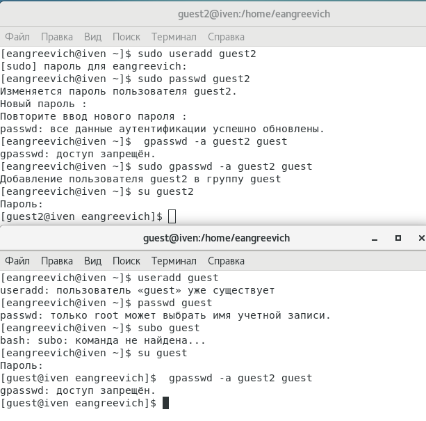{#fig:005 width=70% height=70%}

5. С помощью команды pwd определяю директорию. Определяю, что она является домашней.

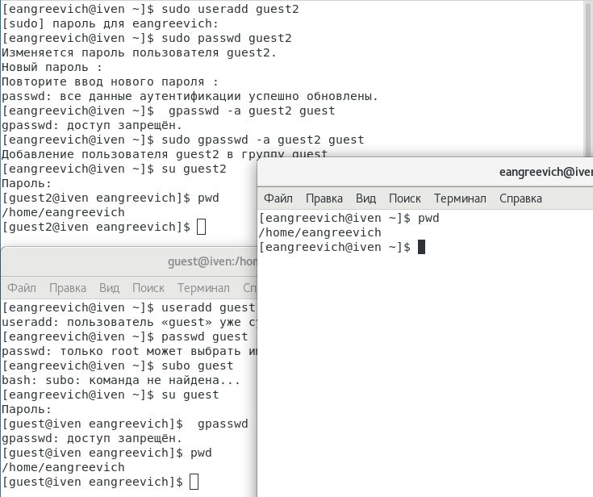{#fig:006 width=70% height=70%}

6. Уточняю имя пользователя, его группу, кто входит в неё и к каким группам принадлежит он сам. Определяю командами groups guest и groups guest2, в какие группы входят пользователи guest и guest2. Сравниваю вывод команды groups с выводом команд id -Gn и id -G..

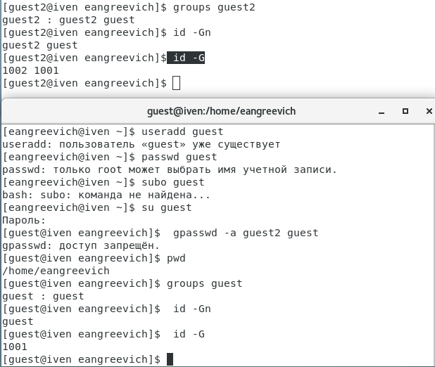{#fig:007 width=70% height=70%}

7. Сравниваю полученные данные с содержимым файла /etc/group.

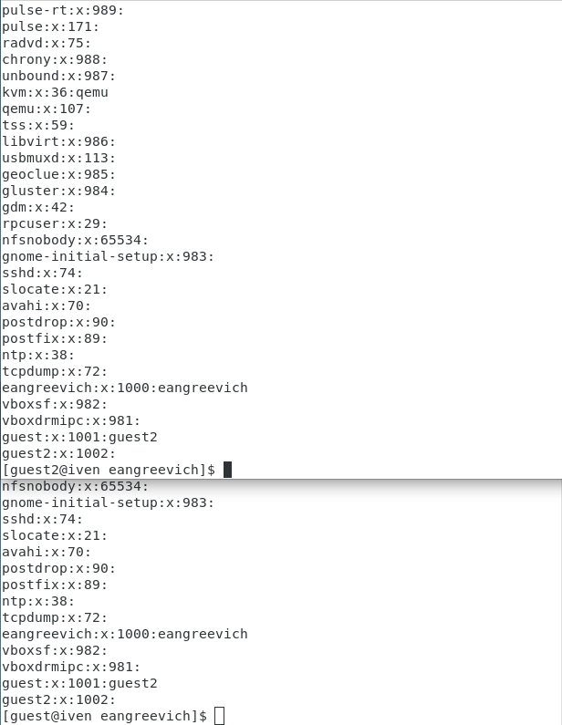{#fig:008 width=70% height=70%}

8. Сравниваю полученные данные с данными в приглашении командной строке.

{#fig:009 width=70% height=70%}

9. От имени пользователя guest измените права директории /home/guest, разрешив все действия для пользователей группы:

chmod g+rwx /home/guest

{#fig:010 width=70% height=20%}

10. От имени пользователя guest снимите с директории /home/guest/dir1
все атрибуты командой chmod 000 dir1 и проверьте правильность снятия атрибутов

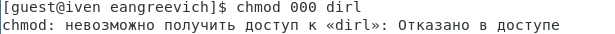{#fig:011 width=70% height=70%}

11. Меняя атрибуты у директории dir1 и файла file1 от имени пользователя guest и делая проверку от пользователя guest2, заполните табл. 3.1,
определив опытным путём, какие операции разрешены, а какие нет. Если операция разрешена, занесите в таблицу знак «+», если не разрешена,
знак «-».

{#fig:012 width=70% height=70%}

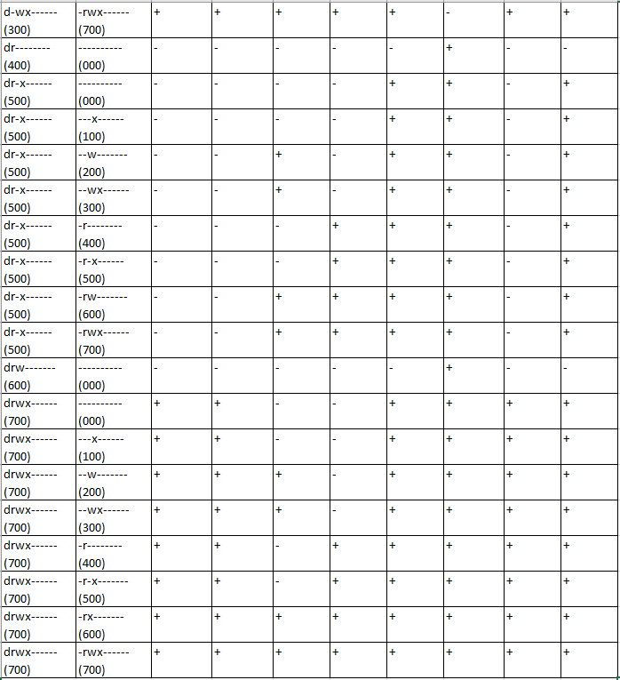{#fig:013 width=70% height=70%}

12. Сравниваю табл. 2.1 (из лабораторной работы № 2) и табл. 3.1.
На основании заполненной таблицы определите те или иные минимально необходимые права для выполнения пользователем guest2 операций
внутри директории dir1 и заполните табл. 3.2.

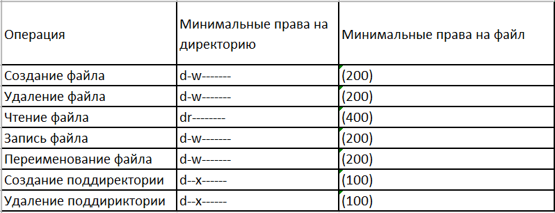{#fig:014 width=70% height=70%}

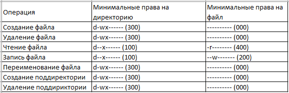{#fig:015 width=70% height=70%}

**Выводы:**

Получены пракические навыки работы в консоли с атрибутами файлов, закреплены теоретические основы дискреционного разграничения доступа в современных системах на базе ОС Linux с двумя пользователями.

# Список литературы {.unnumbered}

1. [Официальный сайт VirtualBox](https://www.virtualbox.org/)
2. [Источник скачивание CentOS](http://isoredirect.centos.org/centos/7/isos/x86_64/)
3. [Материал для выполнения лабораторной](https://esystem.rudn.ru/pluginfile.php/2090275/mod_resource/content/4/003-lab_discret_2users.pdf)
4. [Официальный сайт CentOS](https://www.centos.org/)