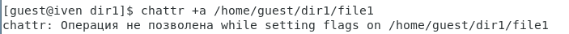
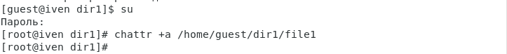
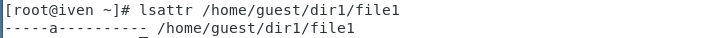
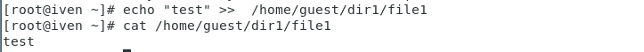
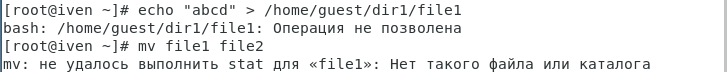
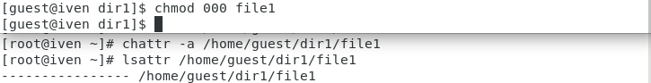
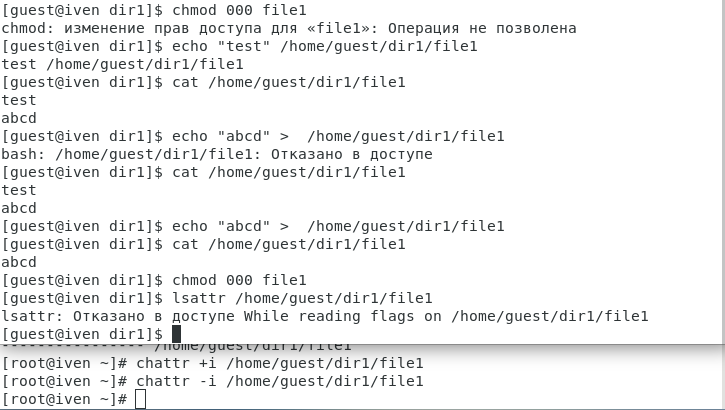

---
## Front matter
title: "Отчёт по лабораторной работе №4"
subtitle: "Дисциплина: Информационная безопасность"
author: "Евдокимов Иван Андреевич"

## Generic otions
lang: ru-RU
toc-title: "Содержание"

## Bibliography
bibliography: bib/cite.bib
csl: pandoc/csl/gost-r-7-0-5-2008-numeric.csl

## Pdf output format
toc: true # Table of contents
toc-depth: 2
lof: true # List of figures
lot: true # List of tables
fontsize: 12pt
linestretch: 1.5
papersize: a4
documentclass: scrreprt
## I18n polyglossia
polyglossia-lang:
  name: russian
  options:
	- spelling=modern
	- babelshorthands=true
polyglossia-otherlangs:
  name: english
## I18n babel
babel-lang: russian
babel-otherlangs: english
## Fonts
mainfont: PT Serif
romanfont: PT Serif
sansfont: PT Sans
monofont: PT Mono
mainfontoptions: Ligatures=TeX
romanfontoptions: Ligatures=TeX
sansfontoptions: Ligatures=TeX,Scale=MatchLowercase
monofontoptions: Scale=MatchLowercase,Scale=0.9
## Biblatex
biblatex: true
biblio-style: "gost-numeric"
biblatexoptions:
  - parentracker=true
  - backend=biber
  - hyperref=auto
  - language=auto
  - autolang=other*
  - citestyle=gost-numeric
## Pandoc-crossref LaTeX customization
figureTitle: "Рис."
tableTitle: "Таблица"
listingTitle: "Листинг"
lofTitle: "Список иллюстраций"
lotTitle: "Список таблиц"
lolTitle: "Листинги"
## Misc options
indent: true
header-includes:
  - \usepackage{indentfirst}
  - \usepackage{float} # keep figures where there are in the text
  - \floatplacement{figure}{H} # keep figures where there are in the text
---

# Техническое оснащение:

-   Персональный компьютер с операционной системой Windows 10;
-   OBS Studio, использующийся для записи скринкаста лабораторной
    работы;
-   Приложение Visual Studio Code для редактирования файлов формата
    *md*, а также для конвертации файлов отчётов и презентаций;

# Цель работы:

Получение практических навыков работы в консоли с расширеннымиатрибутами файлов.

# Выполнение лабораторной работы

1. От имени пользователя guest определяю расширенные атрибуты файла /home/guest/dir1/file1 командой lsattr /home/guest/dir1/file1

{#fig:001 width=70% height=70%}

2. Установливаю командой chmod 600 file1 на файл file1 права, разрешающие чтение и запись для владельца файла.

{#fig:002 width=70% height=70%}

3. Пробую установить на файл /home/guest/dir1/file1 расширенный атрибут a от имени пользователя guest: chattr +a /home/guest/dir1/file1
В ответ получаю отказ от выполнения операции

{#fig:003 width=70% height=70%}

4. Захожу на третью консоль с правами администратора либо повышаю свои права с помощью команды su. Попробуйте установить расширенный атрибут a на файл /home/guest/dir1/file1 от имени суперпользователя:
chattr +a /home/guest/dir1/file1

{#fig:004 width=70% height=70%}

5. От пользователя guest проверяю правильность установления атрибута:
lsattr /home/guest/dir1/file1

{#fig:005 width=70% height=70%}

6. Выполняю дозапись в файл file1 слова «test» командой echo "test" /home/guest/dir1/file1
После этого выполняю чтение файла file1 командой cat /home/guest/dir1/file1
Убеждаюсь, что слово test было успешно записано в file1.

{#fig:006 width=70% height=70%}

7. Пробую удалить файл file1 либо стереть имеющуюся в нём информацию командой echo "abcd" >  home/guest/dirl/file1
Попробуйте переименовать файл.

{#fig:007 width=70% height=70%}

8. Пробую с помощью команды chmod 000 file1 установить на файл file1 права, например, запрещающие чтение и запись для владельца файла. Удалось ли успешно выполнить указанные команды?

{#fig:008 width=70% height=50%}

9. Снимаю расширенный атрибут a с файла /home/guest/dirl/file1 от имени суперпользователя командой chattr -a /home/guest/dir1/file1
Повторите операции, которые вам ранее не удавалось выполнить. Наблюдения занесу в отчёт.

{#fig:009 width=70% height=70%}

10. Повторяю ваши действия по шагам, заменив атрибут «a» атрибутом «i».
Удалось ли вам дозаписать информацию в файл? Ваши наблюдения занесите в отчёт.

{#fig:010 width=70% height=70%}

**Выводы:**

В результате выполнения работы вы повысили свои навыки использования интерфейса командой строки (CLI), познакомились на примерах с тем, как используются основные и расширенные атрибуты при разграничении доступа. Имели возможность связать теорию дискреционного разделения доступа (дискреционная политика безопасности) с её реализацией на практике в ОС Linux. Составили наглядные таблицы, поясняющие какие операции возможны при тех или иных установленных правах. Опробовали действие на практике расширенных атрибутов «а» и «i».

# Список литературы

1.  [Официальный сайт VirtualBox](https://www.virtualbox.org/)
2.  [Материал для выполнения лабораторной](https://esystem.rudn.ru/pluginfile.php/2090277/mod_resource/content/3/004-lab_discret_extattr.pdf)
3.  [Официальный сайт CentOS](https://www.centos.org/)
