---
## Front matter
lang: ru-RU
title: "Лабораторная работа №5. Дискреционноеразграничение прав в Linux. Исследование влияния дополнительных атрибутов"
author:
    - Евдокимов Иван Андреевич. НФИбд-01-20

institute:
    - Российский Университет Дружбы Народов

date: 11 сентября, 2023, Москва, Россия

## Formatting
mainfont: PT Serif
romanfont: PT Serif
sansfont: PT Sans
monofont: PT Mono
toc: false
slide_level: 2
theme: metropolis
header-includes: 
 - \metroset{progressbar=frametitle,sectionpage=progressbar,numbering=fraction}
 - '\makeatletter'
 - '\beamer@ignorenonframefalse'
 - '\makeatother'
aspectratio: 43
section-titles: true
---
# Цель лабораторной работы

Целью данной лабораторной работы является изучить механизмы изменения идентификаторов, применения SetUID- и Sticky-битов. Получение практических навыков работы в консоли с дополнительными атрибутами. Рассмотрение работы механизма смены идентификатора процессов пользователей, а также влияние бита
Sticky на запись и удаление файлов.

## Подготовка лабораторного стенда

Установили компилятор gcc. Отключили систему запретов до очередной перезагрузки системы. После этого команда getenforce вывел *Permissive*. (@fig:001)
   
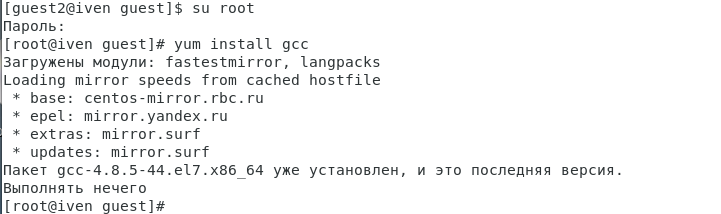{#fig:001 width=100%}

## Создание программы

Вошли в систему от имени пользователя guest и создали программу simpleid.c. (@fig:002)

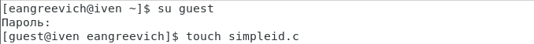{#fig:002 width=100%}

## Создание программы

Скомплилировали программу и убедились, что файл программы создан, выполнили программу simpleid, а затем выполнили системную программу id. Обе программы выводят одинаковые значения для uid и gid. (@fig:003)

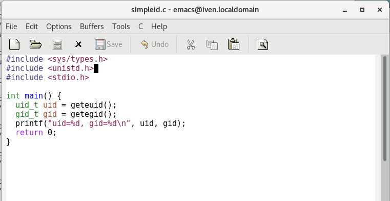{#fig:003 width=100%}

## Создание программы

Усложнили программу, добавив вывод действительных идентификаторов и назвали ее simpleid2.c. (@fig:004)

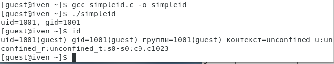{#fig:004 width=100%}

## Создание программы

Скомпилировали и запустили simpleid2.c. (@fig:005)

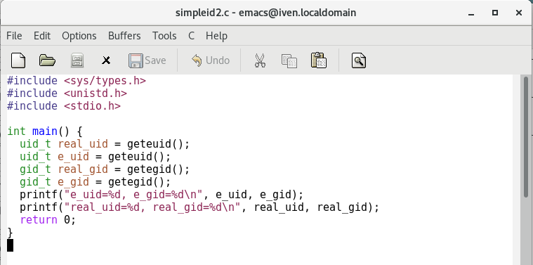{#fig:005 width=50%}

## Создание программы

Повысили временно свои права от имени суперпользователя. Выполнили проверку правильности установки новых атрибутов и смены владельца файла simpleid2. Запустили simpleid2 и id. Значения вывода обеих программ совпадают. (@fig:006)

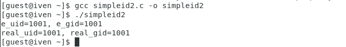{#fig:006 width=100%}

## Создание программы

Проделали тоже самое относительно SetGID-бита. Значения вывода обеих программ совпадают, только в отличие от предыдущего пункта значение e_gid = 1002. (@fig:007)

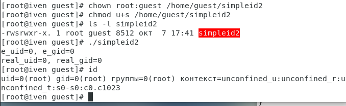{#fig:007 width=100%}

## Создание программы

Создали программу readfile.c. (@fig:008)

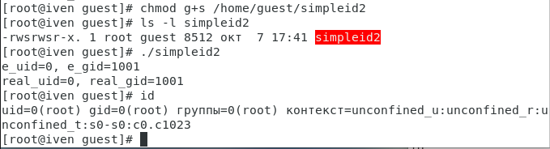{#fig:008 width=100%}

## Создание программы

Откомпилировали программу readfile.c. Сменили владельца у файла и изменили права так, чтобы только суперпользователь мог прочитать его. (@fig:009)

{#fig:009 width=100%}

## Создание программы

Проверили, что пользователь guest не может прочитать файл readfile.c.(@fig:010)

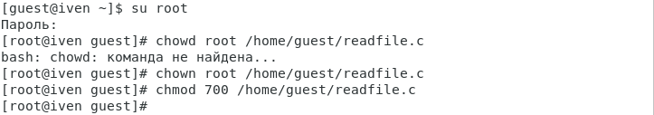{#fig:010 width=100%}

## Создание программы

Сменили у программы readfile владельца и установили SetU’D-бит. (@fig:011)

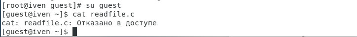{#fig:011 width=100%}

## Создание программы

Проверим, может ли программа readfile прочитать файл readfile.c. (@fig:012)

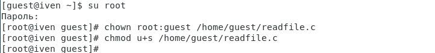{#fig:012 width=100%}

## Создание программы

Проверим, может ли программа readfile прочитать файл /etc/shadow. (@fig:013)

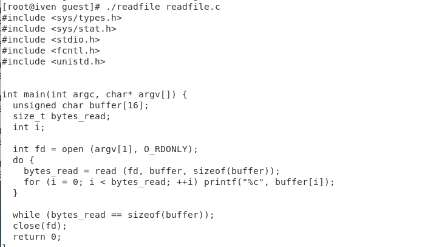{#fig:013 width=100%}

## Исследование Sticky-бита

Выяснили, что установлен атрибут Sticky на директории /tmp. От имени пользователя guest создали файл file01.txt. (@fig:014)

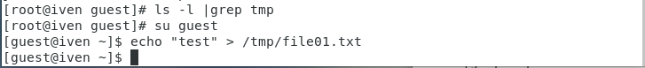{#fig:014 width=100%}

## Исследование Sticky-бита

Просмотрели атрибуты у только что созданного файла и разрешили чтение и запись для категории пользователей «все остальные». (@fig:015)

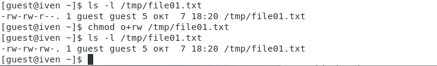{#fig:015 width=100%}

## Исследование Sticky-бита

От пользователя guest2 попробовали прочитать, дозаписать, записать, удалить файл /tmp/file01.txt. Выполнено все, кроме удаления файла. (@fig:016)

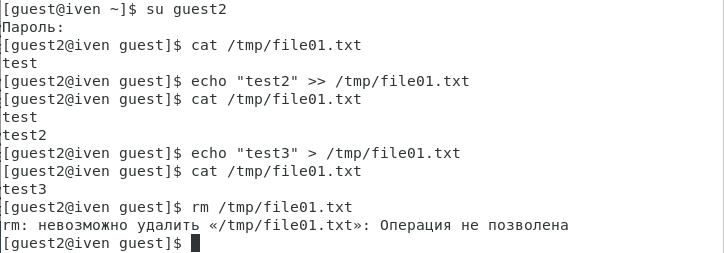{#fig:016 width=100%}

## Исследование Sticky-бита

Повысили свои права до суперпользователя и сняли атрибут t (Sticky-бит) с директории /tmp. (@fig:017)

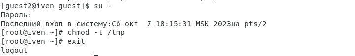{#fig:017 width=100%}

## Исследование Sticky-бита

Повторили предыдущие шаги. В данном случае получилось выполнить удаление файла. (@fig:018)

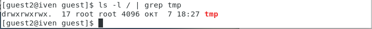{#fig:018 width=100%}

## Исследование Sticky-бита

Повысили свои права до суперпользователя и вернули атрибут t на директорию /tmp. (@fig:019)

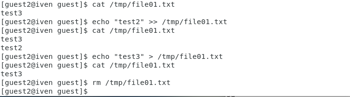{#fig:019 width=100%}

## Выводы:

В ходе выполнения лабораторной работы мы приобрели изучили механизмы изменения идентификаторов, применения SetUID- и Sticky-битов. Получили практические навыки работы в консоли с дополнительными атрибутами. Рассмотрели работу механизма смены идентификатора процессов пользователей, а также влияние бита
Sticky на запись и удаление файлов.

## Библиография

1. Кулябов Д. С., Королькова А. В., Геворкян М. Н. Дискреционное разграничение прав в Linux. Исследование влияния дополнительных атрибутов [Текст] / Кулябов Д. С., Королькова А. В., Геворкян М. Н. - Москва: - 7 с. [^1]: Дискреционное разграничение прав в Linux. Исследование влияния дополнительных атрибутов.
2. Справочник 70 основных команд Linux: полное описание с примерами (https://eternalhost.net/blog/sozdanie-saytov/osnovnye-komandy-linux)
