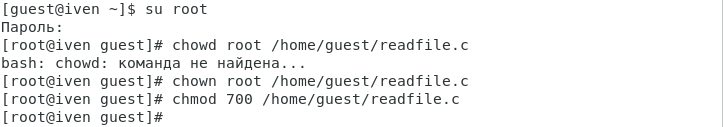

---
## Front matter
title: "Отчёт по лабораторной работе №5"
subtitle: "Дисциплина: Информационная безопасность"
author: "Евдокимов Иван Андреевич"

## Generic otions
lang: ru-RU
toc-title: "Содержание"

## Bibliography
bibliography: bib/cite.bib
csl: pandoc/csl/gost-r-7-0-5-2008-numeric.csl

## Pdf output format
toc: true # Table of contents
toc-depth: 2
lof: true # List of figures
lot: true # List of tables
fontsize: 12pt
linestretch: 1.5
papersize: a4
documentclass: scrreprt
## I18n polyglossia
polyglossia-lang:
  name: russian
  options:
	- spelling=modern
	- babelshorthands=true
polyglossia-otherlangs:
  name: english
## I18n babel
babel-lang: russian
babel-otherlangs: english
## Fonts
mainfont: PT Serif
romanfont: PT Serif
sansfont: PT Sans
monofont: PT Mono
mainfontoptions: Ligatures=TeX
romanfontoptions: Ligatures=TeX
sansfontoptions: Ligatures=TeX,Scale=MatchLowercase
monofontoptions: Scale=MatchLowercase,Scale=0.9
## Biblatex
biblatex: true
biblio-style: "gost-numeric"
biblatexoptions:
  - parentracker=true
  - backend=biber
  - hyperref=auto
  - language=auto
  - autolang=other*
  - citestyle=gost-numeric
## Pandoc-crossref LaTeX customization
figureTitle: "Рис."
tableTitle: "Таблица"
listingTitle: "Листинг"
lofTitle: "Список иллюстраций"
lotTitle: "Список таблиц"
lolTitle: "Листинги"
## Misc options
indent: true
header-includes:
  - \usepackage{indentfirst}
  - \usepackage{float} # keep figures where there are in the text
  - \floatplacement{figure}{H} # keep figures where there are in the text
---

# Техническое оснащение:

-   Персональный компьютер с операционной системой Windows 10;
-   OBS Studio, использующийся для записи скринкаста лабораторной работы;
-   Приложение Visual Studio Code для редактирования файлов формата *md*, а также для конвертации файлов отчётов и презентаций;

# Цель работы:

Целью данной лабораторной работы является изучить механизмы изменения идентификаторов, применения SetUID- и Sticky-битов. Получение практических навыков работы в консоли с дополнительными атрибутами. Рассмотрение работы механизма смены идентификатора процессов пользователей, а также влияние бита
Sticky на запись и удаление файлов.

# Выполнение лабораторной работы

1. Вошёл в систему от имени пользователя guest и создал программу simpleid.c.

{#fig:001 width=40% height=40%}

{#fig:002 width=40% height=40%}

2. Скомпилировал программу и убедился, что файл программы создан. Выполнил программу simpleid. Выполнил системную программу id. В отличие от команды id, моя программа не выводит контекст и все группы, в которые пользователь.

{#fig:003 width=70% height=70%}

3. Усложнил программу, добавив вывод действительных идентификаторов.

{#fig:004 width=70% height=70%}

4. Получившуюся программу назвал simpleid2.c. Скомпилировал и запустил simpleid2.c.

{#fig:005 width=70% height=70%}

5. От имени суперпользователя выполнил команды chown root:guest /home/guest/simpleid2 и chmod u+s /home/guest/simpleid2. Первая команда меняет владельца файла simpleid2 на группу guest. Вторая команда меняет права доступа к файлу simpleid2 для пользователя и установленные атрибуты SUID или SGID позволяют запускать файл на выполнение с правами владельца файла или группы соответственно. Выполнила проверку правильности установки новых атрибутов и смены владельца файла simpleid2. Запустил simpleid2 и id. Сравнил результаты.

{#fig:006 width=70% height=70%}

6. Проделал тоже самое относительно SetGID-бита. Значения вывода обеих программ совпадают, только в отличие от предыдущего пункта значение e_gid = 1002. (@fig:007)

{#fig:007 width=70% height=70%}

7. Создал программу readfile.c
{#fig:008 width=100%}

9. Откомпилировали программу readfile.c:  **gcc readfile.c -o readfile**. Сменили владельца у файла readfile.c и изменили права так, чтобы только суперпользователь (root) мог прочитать его, a guest не мог. (@fig:009)

{#fig:009 width=100%}

10.  Проверили, что пользователь guest не может прочитать файл readfile.c.(@fig:010)

{#fig:010 width=100%}

11. Сменили у программы readfile владельца и установили SetU’D-бит. (@fig:011)

{#fig:011 width=100%}

12. Проверяю, может ли программа readfile прочитать файл readfile.c. Да,  может. (@fig:012)

{#fig:012 width=100%}

13. Проверяю, может ли программа readfile прочитать файл /etc/shadow. Да,  может. (@fig:013)

{#fig:013 width=100%}

## Исследование Sticky-бита

1. Выяснили, что установлен атрибут Sticky на директории /tmp с помощью команды  **ls -l / | grep tmp**. От имени пользователя guest создали файл file01.txt в директории /tmp со словом test. (@fig:014)

{#fig:014 width=100%}

2. Просмотрели атрибуты у только что созданного файла и разрешили чтение и запись для категории пользователей «все остальные». (@fig:015)

{#fig:015 width=100%}

3. От пользователя guest2 (не являющегося владельцем) попробовали прочитать, дозаписать, записать, удалить файл /tmp/file01.txt. Выполнено все, кроме удаления файла. (@fig:016)

{#fig:016 width=100%}

4. Повысили свои права до суперпользователя командой **su -** и выполнили после этого команду, снимающую атрибут t (Sticky-бит) с директории /tmp: **chmod -t /tmp**. Покинули режим суперпользователя командой **exit**.(@fig:017)

{#fig:017 width=100%}

5. От пользователя guest2 проверили, что атрибута t у директории /tmp
нет. (@fig:018)

{#fig:018 width=100%}

6. Повторили предыдущие шаги. В данном случае получилось выполнить удаление файла. (@fig:019)

{#fig:019 width=100%}

7. Повысили свои права до суперпользователя и вернули атрибут t на директорию /tmp. (@fig:020)

{#fig:020 width=100%}

**Выводы:**

В ходе выполнения лабораторной работы мы приобрели изучили механизмы изменения идентификаторов, применения SetUID- и Sticky-битов. Получили практические навыки работы в консоли с дополнительными атрибутами. Рассмотрели работу механизма смены идентификатора процессов пользователей, а также влияние бита
Sticky на запись и удаление файлов.

# Список литературы

1.  [Официальный сайт VirtualBox](https://www.virtualbox.org/)
2.  [Материал для выполнения лабораторной](https://esystem.rudn.ru/pluginfile.php/2090279/mod_resource/content/2/005-lab_discret_sticky.pdf)
3.  [Официальный сайт CentOS](https://www.centos.org/)
