---
## Front matter
lang: ru-RU
title: "Лабораторная работа №6. Мандатное разграничение прав в Linux"
author:
    - Евдокимов Иван Андреевич. НФИбд-01-20

institute:
    - Российский Университет Дружбы Народов

date: 13 октября, 2023, Москва, Россия

## Formatting
mainfont: PT Serif
romanfont: PT Serif
sansfont: PT Sans
monofont: PT Mono
toc: false
slide_level: 2
theme: metropolis
header-includes: 
 - \metroset{progressbar=frametitle,sectionpage=progressbar,numbering=fraction}
 - '\makeatletter'
 - '\beamer@ignorenonframefalse'
 - '\makeatother'
aspectratio: 43
section-titles: true
---
# Цель лабораторной работы

Развить навыки администрирования ОС Linux. Получить первое практическое знакомство с технологией SELinux. Проверить работу SELinx на практике совместно с веб-сервером Apache.

# Процесс выполнения лабораторной работы

1. Вошёл в систему с полученными учётными данными и убедился, что SELinux работает в режиме enforcing политики targeted. Обратился с помощью браузера к веб-серверу, запущенному на компьютере, и убедился, что последний работает (рис. 1).

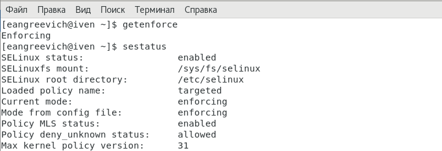 

---

2. Обратитесь с помощью браузера к веб-серверу, запущенному на вашем компьютере, и убедитесь, что последний работает: service httpd status, запустил его так же, но с параметром start.(рис. 2).

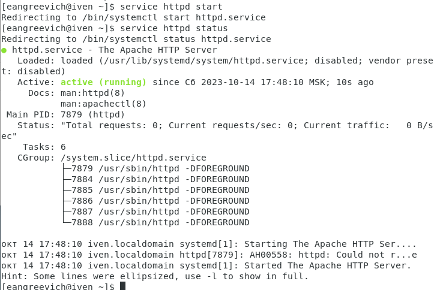

---

3. Найшёл веб-сервер Apache в списке процессов, определил его контекст безопасности , использовав командуps auxZ | grep httpd (рис. 3).

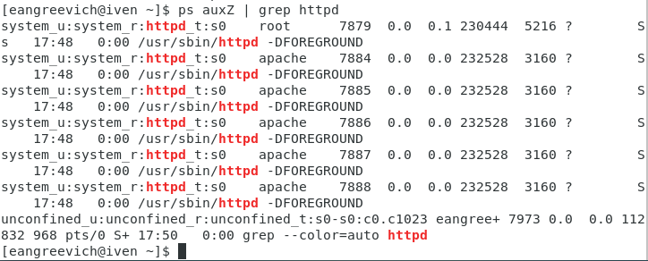

---

4. Посмотрите текущее состояние переключателей SELinux для Apache с помощью команды sestatus -b | grep httpd (рис. 4)

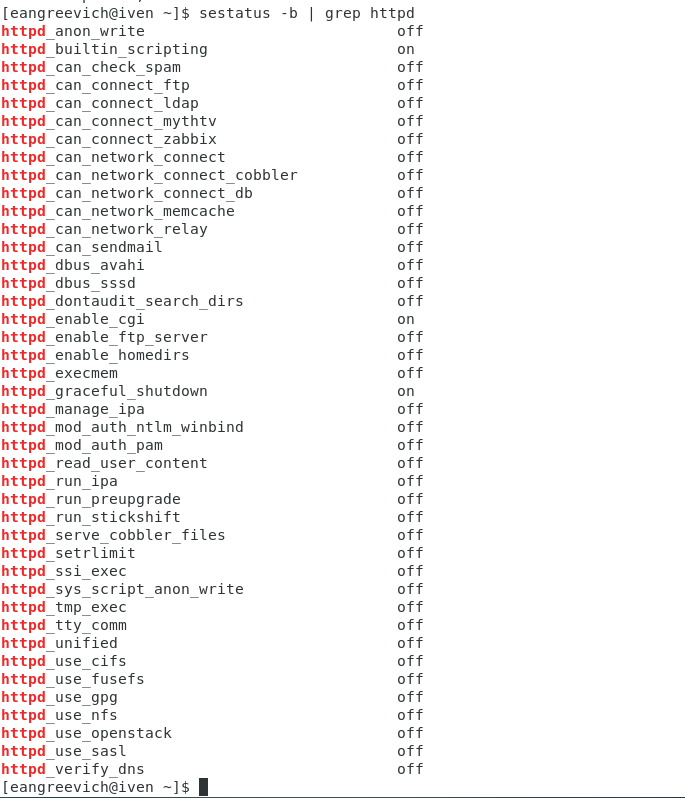

---

5. Посмотрел статистику по политике с помощью команды seinfo, также
определите множество пользователей, ролей, типов. (рис. 5).

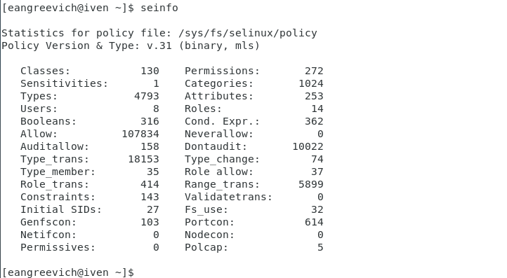

---

6. Определил тип файлов и поддиректорий, находящихся в директории/var/www, с помощью команды ls -lZ /var/www (рис. 6).

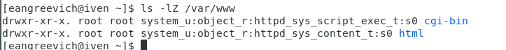

---

7. Определил тип файлов, находящихся в директории /var/www/html:
ls -lZ /var/www/html (рис. 7).

---

8. Определил круг пользователей, которым разрешено создание файлов в
директории /var/www/html. (рис. 8).

---

9. Создал от имени суперпользователя (так как в дистрибутиве после установки только ему разрешена запись в директорию) html-файл /var/www/html/test.html (рис. 9).

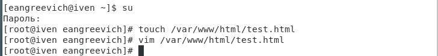

---

10. Проверьте контекст созданного вами файла. Занесите в отчёт контекст, присваиваемый по умолчанию вновь созданным файлам в директории /var/www/html. (рис. 10).

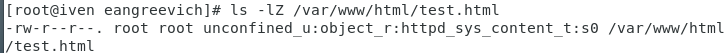

---

11. Обратился к файлу через веб-сервер, введя в браузере адрес http://127.0.0.1/test.html. Убедился, что файл был успешно отображён. (рис. 11).

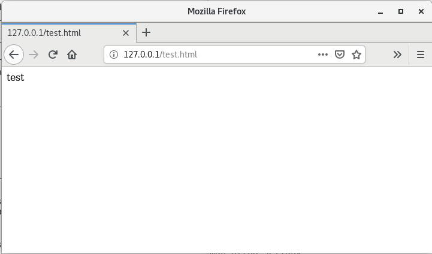

---

12. Изучил справку man httpd_selinux и выясните, какие контексты файлов определены для httpd. Сопоставил их с типом файла test.html. Проверить контекст файла можно командой ls -Z. ls -Z /var/www/html/test.html (рис. 12).

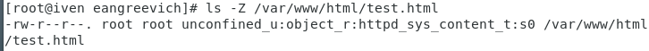

---

13. Изменил контекст файла /var/www/html/test.html httpd_sys_content_t на любой другой, к которому процесс httpd не должен иметь доступа, например, на samba_share_t: chcon -t samba_share_t /var/www/html/test.html ls -Z /var/www/html/test.html После этого проверил, что контекст поменялся.(рис. 13).

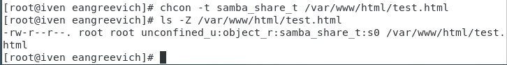

---

14. Попробуйте ещё раз получить доступ к файлу через веб-сервер, введя в браузере адрес http://127.0.0.1/test.html. Вы должны получить сообщение об ошибке:
Forbidden
You don't have permission to access /test.html on this server. (рис. 14).

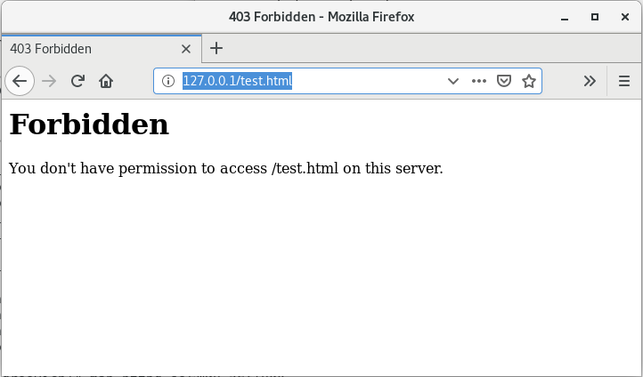

---

15. Проанализировал ситуацию. Почему файл не был отображён, если права
доступа позволяют читать этот файл любому пользователю?
ls -l /var/www/html/test.html
Просмотрите log-файлы веб-сервера Apache. Также просмотрел системный лог-файл:
tail /var/log/messages
(рис. 15).

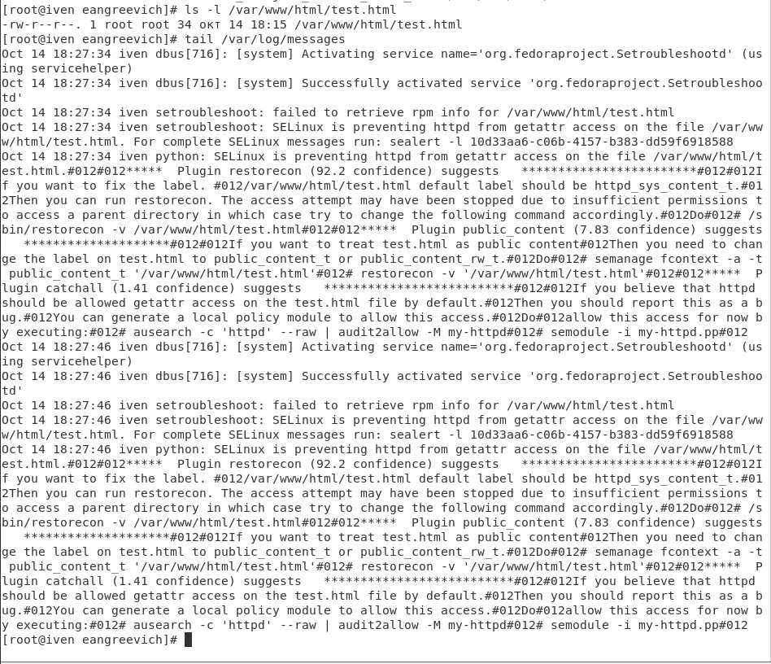

---

16. Попробовал запустить веб-сервер Apache на прослушивание ТСР-порта 81 (а не 80, как рекомендует IANA и прописано в /etc/services). Для этого в файле /etc/httpd/httpd.conf найдите строчку Listen 80 и замените её на Listen 81. (рис. 16).

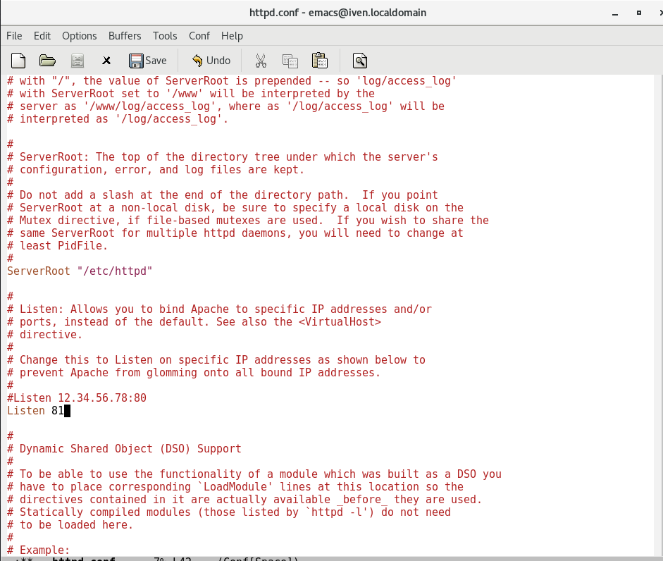

---

17. Выполните перезапуск веб-сервера Apache. Произошёл сбой (рис. 17).

---

18. Проанализировал лог-файлы: tail -nl /var/log/messages Просмотрел файлы /var/log/http/error_log,
/var/log/http/access_log и /var/log/audit/audit.log и выяснил, в каких файлах появились записи (рис. 18).

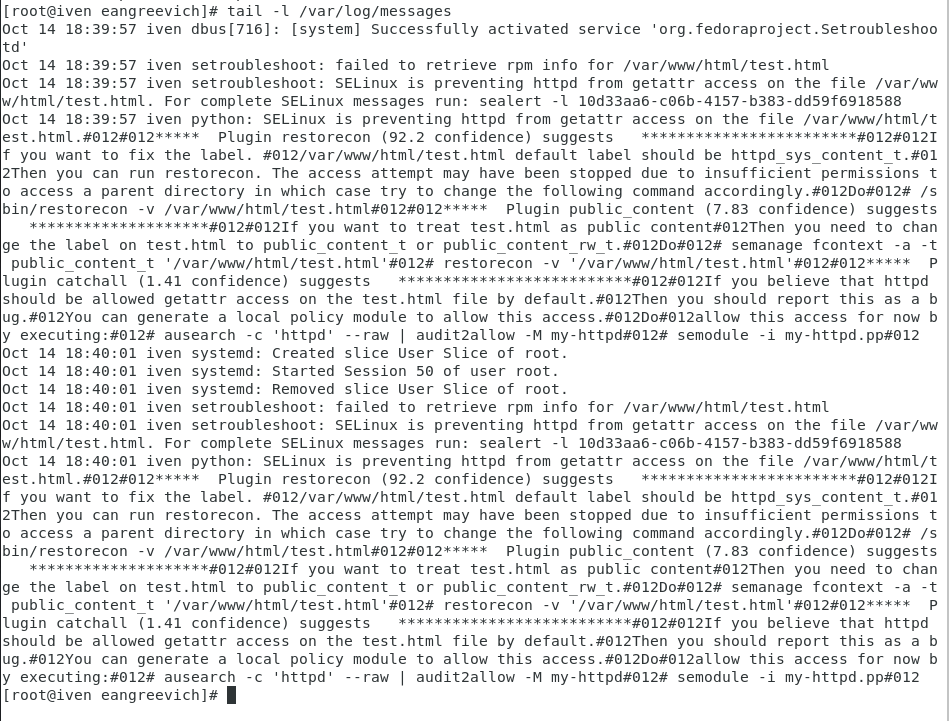

---

19. Выполнил команду semanage port -a -t http_port_t -р tcp 81 После этого проверил список портов командой
semanage port -l | grep http_port_t
Убедился, что порт 81 появился в списке(рис. 19).

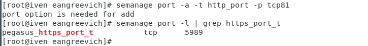

---

20. Пробую запустить веб-сервер Apache ещё раз (рис. 20).

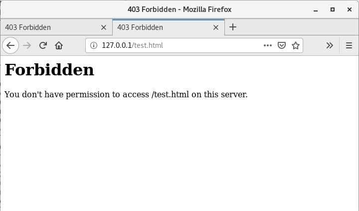.  

---

21. Вернул контекст httpd_sys_cоntent__t к файлу /var/www/html/ test.html: chcon -t httpd_sys_content_t /var/www/html/test.html После этого попробовал получить доступ к файлу через веб-сервер, введя в браузере адрес http://127.0.0.1:81/test.html. Увидеть содержимое файла — слово «test»(рис. 21).

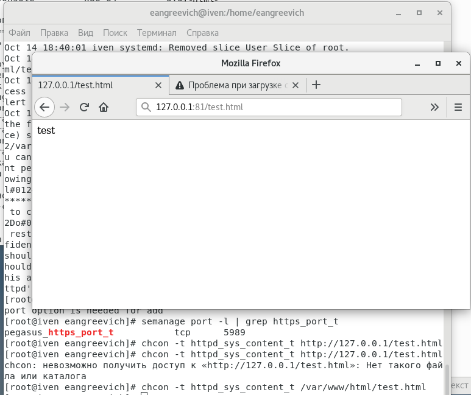. 

---

22. . Исправил обратно конфигурационный файл apache, вернув Listen 80 (рис. 22).

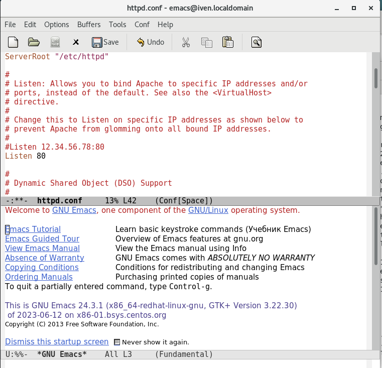. 

---

23. Удалил привязку http_port_t к 81 порту:
semanage port -d -t http_port_t -p tcp 81
и проверил, что порт 81 удалён,затем удалил файл /var/www/html/test.html:
rm /var/www/html/test.html

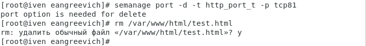.

---

# Выводы:

Развил навыки администрирования ОС Linux. Получил первое практическое знакомство с технологией SELinux. Проверил работу SELinx на практике совместно с веб-сервером Apache.
