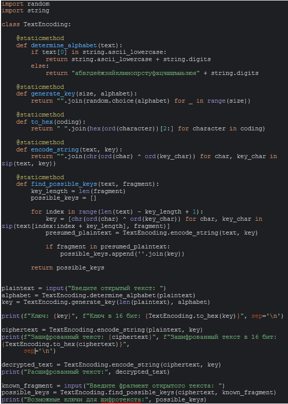
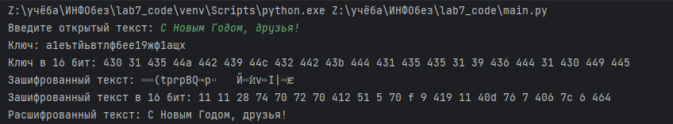
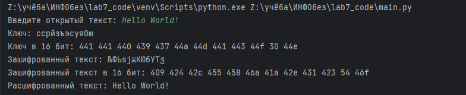

---
## Front matter
lang: ru-RU
title: "Лабораторная работа №7. Элементы криптографии. Однократное гаммирование"
author:
    - Евдокимов Иван Андреевич. НФИбд-01-20

institute:
    - Российский Университет Дружбы Народов

date: 20 октября, 2023, Москва, Россия

## Formatting
mainfont: PT Serif
romanfont: PT Serif
sansfont: PT Sans
monofont: PT Mono
toc: false
slide_level: 2
theme: metropolis
header-includes: 
 - \metroset{progressbar=frametitle,sectionpage=progressbar,numbering=fraction}
 - '\makeatletter'
 - '\beamer@ignorenonframefalse'
 - '\makeatother'
aspectratio: 43
section-titles: true
---
# Цель лабораторной работы

Освоить на практике применение режима однократного гаммирования.

# Процесс выполнения лабораторной работы

0. Код программы

{#fig:001 width=70% height=70%}

---

1. Вывод запуска программы 1 

{#fig:002 width=70% height=70%}

---

2. Вывод запуска программы 2

{#fig:003 width=70% height=70%}

---

3. Вывод запуска программы 3 на английском

{#fig:004 width=70% height=70%}

---

4. Вывод запуска программы 4 на английском

{#fig:005 width=70% height=70%}

# Контрольные вопросы

1. Поясните смысл однократного гаммирования.
Ответ: это шифрование симметричным методом, сущность которого заключается в «наложении» последовательности, сформированной из случайных чисел, на открытый текст. Прощё говоря это шифрование где количество символов совпадает в ключе и тексте совпадает и без ключа нельзя одназначно декодировать текст обратна. С моей точки зрения это аналог принципа шифрование в знаменитой Энигме, но с случайными символами в ключе.
2. Перечислите недостатки однократного гаммирования.
Ответ: Необходимо передавать ключ с словом так как его невозможно создать заранее, а также сложность обмена ключами в большой системе и вероятность его повреждение что сразу сделает дешифровку невозможной.

## Контрольные вопросы

3. Перечислите преимущества однократного гаммирования.
Ответ: Простой и одинаковый процесс кодирования и декодирования, единый ключ для шифровки и дешифровки, скорость обработки и передачи так как требуется лишь текст и его ключ.
4. Почему длина открытого текста должна совпадать с длиной ключа?
Ответ: Так как при кодирование элемент ключа закрепляется за соответствующим элементом сообщения из-за чего и возможна одназначна декадировать сообщение.

## Контрольные вопросы

5. Какая операция используется в режиме однократного гаммирования, назовите её особенности?
Ответ: Фактически ответ содержится в одном из названий этого принципа "Шифр XOR", тоесть в его основе находится строгая дизъюнкция которая и принимает в себя случайный ключ и текст и обратно "отзеркаливает" если вернуть зашифрованный текст вместе с ключём.
6. Как по открытому тексту и ключу получить шифротекст?
Ответ: Для получения шифротекста применяем операцию исключающего ИЛИ (XOR) между каждым символом открытого текста и соответствующим символом ключа. Процесс можно построить следующим образом: открытый текст и ключ в виде последовательности байтов или символов;  поэлементно выполняем операцию XOR с открытого текста и ключа; резуьтат этой операции и будет шифротекст.

## Контрольные вопросы

7. Как по открытому тексту и шифротексту получить ключ?
Ответ: Сооответсвенно онологичная процедура из 6 пункта, так как процесс кодирование и декадирование одинаковы.
8. В чем заключаются необходимые и достаточные условия абсолютной стойкости шифра?
Ответ: Определить это можно проведя проверку через "Доказательство абсолютной стойкости Шеннона" (в основе которого лежит принцип абсолютной стойкости шифра — шифр, характеризующийся тем, что криптоаналитик принципиально не сможет извлечь статистическую информацию относительно выбираемых ключей из перехватываемого шифротекста.). Так Клод Шеннон доказал, что при определённых свойствах гаммы этот метод шифрования является абсолютно стойким (гамма выступает в роли случайно сгенерированного ключа) и данные условия просты: при шифрование ключ создаётся случайно и свегда занова, для гаммы нужно использовать "аппаратные генераторы случайных чисел" и длина гаммы должна быть не меньше длины защищаемого сообщения.

# Выводы:

Мною были освоино на практике применение режима однократного гаммирования.
