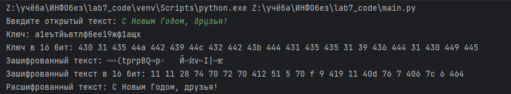
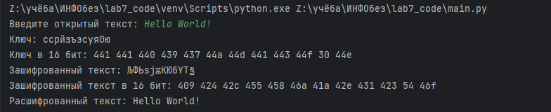

---
## Front matter
title: "Отчёт по лабораторной работе №7"
subtitle: "Дисциплина: Информационная безопасность"
author: "Евдокимов Иван Андреевич"

## Generic otions
lang: ru-RU
toc-title: "Содержание"

## Bibliography
bibliography: bib/cite.bib
csl: pandoc/csl/gost-r-7-0-5-2008-numeric.csl

## Pdf output format
toc: true # Table of contents
toc-depth: 2
lof: true # List of figures
lot: true # List of tables
fontsize: 12pt
linestretch: 1.5
papersize: a4
documentclass: scrreprt
## I18n polyglossia
polyglossia-lang:
  name: russian
  options:
	- spelling=modern
	- babelshorthands=true
polyglossia-otherlangs:
  name: english
## I18n babel
babel-lang: russian
babel-otherlangs: english
## Fonts
mainfont: PT Serif
romanfont: PT Serif
sansfont: PT Sans
monofont: PT Mono
mainfontoptions: Ligatures=TeX
romanfontoptions: Ligatures=TeX
sansfontoptions: Ligatures=TeX,Scale=MatchLowercase
monofontoptions: Scale=MatchLowercase,Scale=0.9
## Biblatex
biblatex: true
biblio-style: "gost-numeric"
biblatexoptions:
  - parentracker=true
  - backend=biber
  - hyperref=auto
  - language=auto
  - autolang=other*
  - citestyle=gost-numeric
## Pandoc-crossref LaTeX customization
figureTitle: "Рис."
tableTitle: "Таблица"
listingTitle: "Листинг"
lofTitle: "Список иллюстраций"
lotTitle: "Список таблиц"
lolTitle: "Листинги"
## Misc options
indent: true
header-includes:
  - \usepackage{indentfirst}
  - \usepackage{float} # keep figures where there are in the text
  - \floatplacement{figure}{H} # keep figures where there are in the text
---

# Техническое оснащение:

-   Персональный компьютер с операционной системой Windows 10;
-   OBS Studio, использующийся для записи скринкаста лабораторной работы;
-   Приложение Visual Studio Code для редактирования файлов формата *md*, а также для конвертации файлов отчётов и презентаций;

# Цель работы:

Освоить на практике применение режима однократного гаммирования.

# Постановка задачи

Нужно подобрать ключ, чтобы получить сообщение «С Новым Годом, друзья!». Требуется разработать приложение, позволяющее шифровать и дешифровать данные в режиме однократного гаммирования. Приложение должно:

# Код программы

```
# Импортируем модули для работы со строками и для генерации случайных чисел
import random
import string


# Создаем класс для кодирования и декодирования текста
class TextEncoding:

    @staticmethod
    # Метод для определения алфавита, который следует использовать для генерации ключа
    def determine_alphabet(text):
        # Если первый символ текста в английском алфавите (в нижнем регистре),
        # то возвращаем английский алфавит и цифры
        if text[0] in string.ascii_lowercase:
            return string.ascii_lowercase + string.digits
        else:
            # В противном случае возвращаем русский алфавит и цифры
            return "абвгдеёжзийклмнопрстуфхцчшщъыьэюя" + string.digits

    @staticmethod
    # Метод для генерации ключа
    # Ключ состоит из случайных символов алфавита (определенного в методе determine_alphabet)
    def generate_key(size, alphabet):
        return "".join(random.choice(alphabet) for _ in range(size))

    @staticmethod
    # Метод для преобразования строки в шестнадцатеричный формат
    # Каждый символ кодируется в шестнадцатеричную систему и объединяется в строку с помощью пробела
    def to_hex(coding):
        return " ".join(hex(ord(character))[2:] for character in coding)

    @staticmethod
    # Метод для кодирования строки
    # Происходит применение операции XOR между кодами символов текста и ключа
    def encode_string(text, key):
        return "".join(chr(ord(char) ^ ord(key_char)) for char, key_char in zip(text, key))

    @staticmethod
    # Метод для поиска возможных ключей
    # Принимает на вход строку текста и фрагмент этого текста
    # Создает список возможных ключей, которые могут декодировать зашифрованный текст обратно в известный фрагмент
    def find_possible_keys(text, fragment):
        key_length = len(fragment)
        possible_keys = []

        # Проходим по всему тексту с шагом, равным длине фрагмента
        for index in range(len(text) - key_length + 1):
            # Получаем возможный ключ путем применения операции XOR между очередной частью текста и фрагментом
            key = [chr(ord(char) ^ ord(key_char)) for char, key_char in zip(text[index:index + key_length], fragment)]
            # Предполагаемый расшифрованный текст получаем путем кодирования зашифрованного текста с использованием полученного ключа
            presumed_plaintext = TextEncoding.encode_string(text, key)

            # Если известный фрагмент присутствует в предполагаемом расшифрованном тексте, добавляем ключ в список возможных
            if fragment in presumed_plaintext:
                possible_keys.append(''.join(key))

        return possible_keys

# Получаем от пользователя открытый текст
plaintext = input("Введите открытый текст: ")
# Определяем алфавит для генерации ключа
alphabet = TextEncoding.determine_alphabet(plaintext)
# Генерируем ключ
key = TextEncoding.generate_key(len(plaintext), alphabet)

# Выводим сгенерированный ключ и его шестнадцатеричное представление
print(f"Ключ: {key}", f"Ключ в 16 бит: {TextEncoding.to_hex(key)}", sep='\n')

# Кодируем открытый текст с помощью сгенерированного ключа
ciphertext = TextEncoding.encode_string(plaintext, key)
# Выводим зашифрованный текст и его шестнадцатеричное представление
print(f"Зашифрованный текст: {ciphertext}", f"Зашифрованный текст в 16 бит: {TextEncoding.to_hex(ciphertext)}",
      sep='\n')

# Декодируем зашифрованный текст с помощью сгенерированного ключа
decrypted_text = TextEncoding.encode_string(ciphertext, key)
# Выводим расшифрованный текст
print("Расшифрованный текст:", decrypted_text)

# Получаем от пользователя известный фрагмент открытого текста
known_fragment = input("Введите фрагмент открытого текста: ")
# Ищем возможные ключи для шифротекста
possible_keys = TextEncoding.find_possible_keys(ciphertext, known_fragment)
# Выводим найденные ключи
print("Возможные ключи для шифротекста:", possible_keys)

```
вывод запуска программы 1 (шифровка и дишифровка текста).

{#fig:001 width=70% height=70%}

вывод запуска программы 2 (шифровка фрагмента текста).

{#fig:002 width=70% height=70%}

вывод запуска программы 3 на английском (шифровка и дишифровка текста на английском).

{#fig:003 width=70% height=70%}

вывод запуска программы 4 на английском (шифровка фрагмента текста на английском).

{#fig:004 width=70% height=70%}

на видео к выполнения работы будут представленны более удачные варианты запуска программы

**Выводы:**

Мною были освоино на практике применение режима однократного гаммирования.

# Список литературы

1.  [Официальный сайт VirtualBox](https://www.virtualbox.org/)
2.  [Материал для выполнения лабораторной](https://esystem.rudn.ru/pluginfile.php/2090284/mod_resource/content/2/007-lab_crypto-gamma.pdf)
3.  [Официальный сайт CentOS](https://www.centos.org/)
