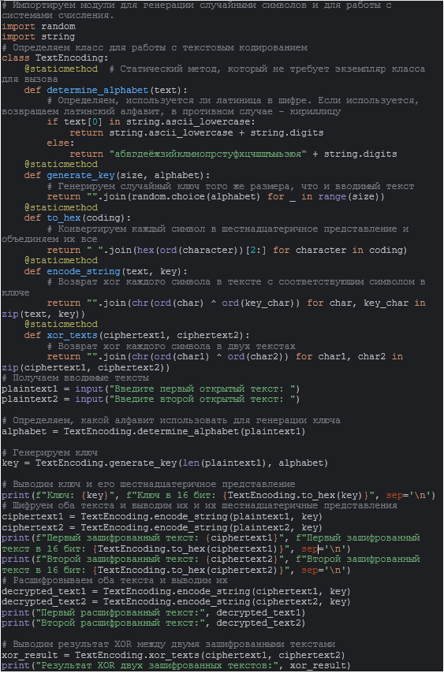
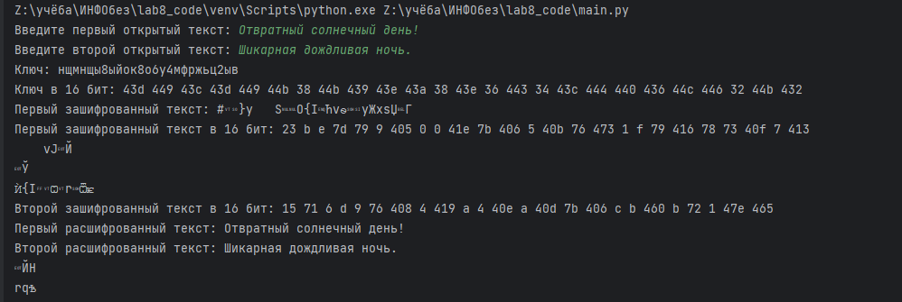
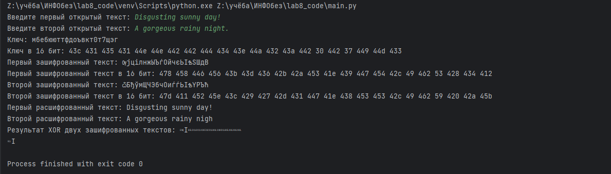

---
## Front matter
lang: ru-RU
title: "Лабораторная работа №8. Элементы криптографии. Шифрование (кодирование) различных исходных текстов одним ключом"
author:
    - Евдокимов Иван Андреевич. НФИбд-01-20

institute:
    - Российский Университет Дружбы Народов

date: 20 октября, 2023, Москва, Россия

## Formatting
mainfont: PT Serif
romanfont: PT Serif
sansfont: PT Sans
monofont: PT Mono
toc: false
slide_level: 2
theme: metropolis
header-includes: 
 - \metroset{progressbar=frametitle,sectionpage=progressbar,numbering=fraction}
 - '\makeatletter'
 - '\beamer@ignorenonframefalse'
 - '\makeatother'
aspectratio: 43
section-titles: true
---
# Цель лабораторной работы

Освоить на практике применение режима однократного гаммирования на примере кодирования различных исходных текстов одним ключом.

# Процесс выполнения лабораторной работы

0. Код программы

{#fig:001 width=70% height=70%}

---

1. Вывод запуска программы 1 

{#fig:002 width=70% height=70%}

---

2. Вывод запуска программы 3 на английском

{#fig:003 width=70% height=70%}

# Контрольные вопросы

 1. Как, зная один из текстов (P1 или P2), определить другой, не зная при этом ключа?
Ответ: Это возможно сделать только в том случае если текст P1 и P2 одной длины и имеют общий ключ.

2. Что будет при повторном использовании ключа при шифровании текста?
Ответ: Из-за одинаковости способа кодирование и декодирование после повторного использование слова и ключа даст нам шифротекст.

3. Как реализуется режим шифрования однократного гаммирования одним ключом двух открытых текстов?
Ответ: Фактически следуя схеме 8.1 и принципу "шифра XOR" мы просто имеет два параллельных кодирование и декодирование с использованием одного ключа.

## Контрольные вопросы

4. Перечислите недостатки шифрования одним ключом двух открытых текстов.
Ответ: Если вспомнить тредования для абсолютной стойкости шифра расмотренных в предедущей лабораторной то можно сразу понять по первому пункту что если ключ не будет случайным и каждый раз новым для каждой строки то найдя пересечения или аналоги в шифротекстах можно определить одинаковые символы что может пошатнуть защиту текста даже если у вас нет ни одного исходного кода, а если и есть то определить другие слова легко.

## Контрольные вопросы

5. Перечислите преимущества шифрования одним ключом двух открытых текстов.
Ответ: На самом деле они есть, но они сомнительны: требуется передать один ключ что сделать проще и быстрее, при передаче большого количества шифротекста нет шанса запутаться в их порядке сочетания с ключами.

# Выводы:

Освоил на практике применение режима однократного гаммирования на примере кодирования различных исходных текстов одним ключом.
