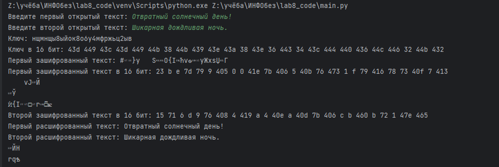
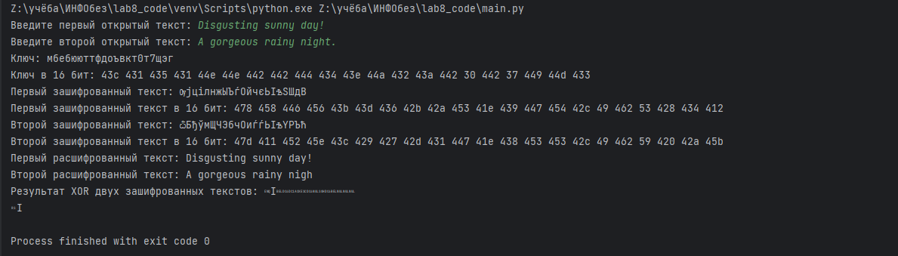

---
## Front matter
title: "Отчёт по лабораторной работе №8"
subtitle: "Дисциплина: Информационная безопасность"
author: "Евдокимов Иван Андреевич"

## Generic otions
lang: ru-RU
toc-title: "Содержание"

## Bibliography
bibliography: bib/cite.bib
csl: pandoc/csl/gost-r-7-0-5-2008-numeric.csl

## Pdf output format
toc: true # Table of contents
toc-depth: 2
lof: true # List of figures
lot: true # List of tables
fontsize: 12pt
linestretch: 1.5
papersize: a4
documentclass: scrreprt
## I18n polyglossia
polyglossia-lang:
  name: russian
  options:
	- spelling=modern
	- babelshorthands=true
polyglossia-otherlangs:
  name: english
## I18n babel
babel-lang: russian
babel-otherlangs: english
## Fonts
mainfont: PT Serif
romanfont: PT Serif
sansfont: PT Sans
monofont: PT Mono
mainfontoptions: Ligatures=TeX
romanfontoptions: Ligatures=TeX
sansfontoptions: Ligatures=TeX,Scale=MatchLowercase
monofontoptions: Scale=MatchLowercase,Scale=0.9
## Biblatex
biblatex: true
biblio-style: "gost-numeric"
biblatexoptions:
  - parentracker=true
  - backend=biber
  - hyperref=auto
  - language=auto
  - autolang=other*
  - citestyle=gost-numeric
## Pandoc-crossref LaTeX customization
figureTitle: "Рис."
tableTitle: "Таблица"
listingTitle: "Листинг"
lofTitle: "Список иллюстраций"
lotTitle: "Список таблиц"
lolTitle: "Листинги"
## Misc options
indent: true
header-includes:
  - \usepackage{indentfirst}
  - \usepackage{float} # keep figures where there are in the text
  - \floatplacement{figure}{H} # keep figures where there are in the text
---

# Техническое оснащение:

-   Персональный компьютер с операционной системой Windows 10;
-   OBS Studio, использующийся для записи скринкаста лабораторной работы;
-   Приложение Visual Studio Code для редактирования файлов формата *md*, а также для конвертации файлов отчётов и презентаций;

# Цель работы:

Освоить на практике применение режима однократного гаммирования на примере кодирования различных исходных текстов одним ключом.

# Постановка задачи

Два текста кодируются одним ключом (однократное гаммирование).
Требуется не зная ключа и не стремясь его определить, прочитать оба текста. Необходимо разработать приложение, позволяющее шифровать и дешифровать тексты P1 и P2 в режиме однократного гаммирования. Приложение должно определить вид шифротекстов C1 и C2 обоих текстов P1 и
P2 при известном ключе ; Необходимо определить и выразить аналитически способ, при котором злоумышленник может прочитать оба текста, не
зная ключа и не стремясь его определить.

# Код программы

```
# Импортируем модули для генерации случайными символов и для работы с системами счисления.
import random
import string

# Определяем класс для работы с текстовым кодированием
class TextEncoding:

    @staticmethod  # Статический метод, который не требует экземпляр класса для вызова
    def determine_alphabet(text):
        # Определяем, используется ли латиница в шифре. Если используется, возвращаем латинский алфавит, в противном случае - кириллицу
        if text[0] in string.ascii_lowercase:
            return string.ascii_lowercase + string.digits
        else:
            return "абвгдеёжзийклмнопрстуфхцчшщъыьэюя" + string.digits

    @staticmethod
    def generate_key(size, alphabet):
        # Генерируем случайный ключ того же размера, что и вводимый текст
        return "".join(random.choice(alphabet) for _ in range(size))

    @staticmethod
    def to_hex(coding):
        # Конвертируем каждый символ в шестнадцатеричное представление и объединяем их все
        return " ".join(hex(ord(character))[2:] for character in coding)

    @staticmethod
    def encode_string(text, key):
        # Возврат xor каждого символа в тексте с соответствующим символом в ключе
        return "".join(chr(ord(char) ^ ord(key_char)) for char, key_char in zip(text, key))

    @staticmethod
    def xor_texts(ciphertext1, ciphertext2):
        # Возврат xor каждого символа в двух текстах
        return "".join(chr(ord(char1) ^ ord(char2)) for char1, char2 in zip(ciphertext1, ciphertext2))


# Получаем вводимые тексты
plaintext1 = input("Введите первый открытый текст: ")
plaintext2 = input("Введите второй открытый текст: ")

# Определяем, какой алфавит использовать для генерации ключа
alphabet = TextEncoding.determine_alphabet(plaintext1)

# Генерируем ключ
key = TextEncoding.generate_key(len(plaintext1), alphabet)

# Выводим ключ и его шестнадцатеричное представление
print(f"Ключ: {key}", f"Ключ в 16 бит: {TextEncoding.to_hex(key)}", sep='\n')

# Шифруем оба текста и выводим их и их шестнадцатеричные представления
ciphertext1 = TextEncoding.encode_string(plaintext1, key)
ciphertext2 = TextEncoding.encode_string(plaintext2, key)
print(f"Первый зашифрованный текст: {ciphertext1}", f"Первый зашифрованный текст в 16 бит: {TextEncoding.to_hex(ciphertext1)}", sep='\n')
print(f"Второй зашифрованный текст: {ciphertext2}", f"Второй зашифрованный текст в 16 бит: {TextEncoding.to_hex(ciphertext2)}", sep='\n')

# Расшифровываем оба текста и выводим их
decrypted_text1 = TextEncoding.encode_string(ciphertext1, key)
decrypted_text2 = TextEncoding.encode_string(ciphertext2, key)
print("Первый расшифрованный текст:", decrypted_text1)
print("Второй расшифрованный текст:", decrypted_text2)

# Выводим результат XOR между двумя зашифрованными текстами
xor_result = TextEncoding.xor_texts(ciphertext1, ciphertext2)
print("Результат XOR двух зашифрованных текстов:", xor_result)

```
вывод запуска программы 1 (шифровка и дишифровка текста).

{#fig:001 width=70% height=70%}

вывод запуска программы 2 на английском (шифровка и дишифровка текста на английском).

{#fig:002 width=70% height=70%}

**Выводы:**

Освоил на практике применение режима однократного гаммирования на примере кодирования различных исходных текстов одним ключом.

# Список литературы

1.  [Официальный сайт VirtualBox](https://www.virtualbox.org/)
2.  [Материал для выполнения лабораторной](https://esystem.rudn.ru/pluginfile.php/2090277/mod_resource/content/3/004-lab_discret_extattr.pdf)
3.  [Официальный сайт CentOS](https://www.centos.org/)
